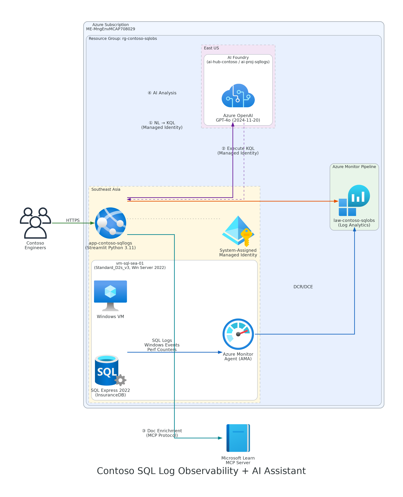

# Tutorial: Centralised SQL Server Log Monitoring with AI-Powered Analysis on Azure

> **Level:** Intermediate  
> **Duration:** 90 minutes  
> **Last updated:** April 2026

## Introduction

This tutorial walks you through a complete end-to-end scenario where **Contoso Ltd.** deploys a SQL Server Express instance on an Azure Virtual Machine, collects its logs centrally using Azure Monitor, and then builds an AI-powered chat application that lets engineers query those logs using natural language.

By the end of this tutorial you will be able to:

- Provision an Azure VM running SQL Server Express in the Southeast Asia region.
- Install the **Azure Monitor Agent (AMA)** and configure **Data Collection Rules (DCR)** to stream Windows Event Logs and Performance Counters to a **Log Analytics workspace**.
- Deploy **Azure OpenAI Service** with a GPT-4o model in the East US region and connect it to an **Azure AI Foundry** project.
- Deploy a **Streamlit** front-end on **Azure App Service** (Linux) that lets users ask natural-language questions about SQL Server logs.

> **Deploy now?** Jump to the **[Deploy Guidance](deploy-guidance.md)** for a step-by-step deployment walkthrough, pre-deployment checklist, troubleshooting guide, and production hardening recommendations.

---

## Key Concepts and Definitions

Before you begin, familiarise yourself with the core Azure services and concepts used in this solution.

### Azure Virtual Machines

An [Azure Virtual Machine (VM)](https://learn.microsoft.com/azure/virtual-machines/overview) is an on-demand, scalable computing resource that gives you the flexibility of virtualisation without having to buy and maintain the physical hardware. Azure VMs support Windows and Linux operating systems and are available in a wide range of sizes optimised for different workloads.

In this scenario, Contoso uses a **Windows Server 2022** VM to host SQL Server Express in the Southeast Asia region.

### SQL Server Express

[SQL Server Express](https://learn.microsoft.com/sql/sql-server/editions-and-components-of-sql-server-2022) is a free edition of Microsoft SQL Server suitable for development, small databases (up to 10 GB), and lightweight production workloads. It includes the core database engine but does not include SQL Server Agent, full-text search, or other enterprise features. Because it is free and lightweight, it is frequently used for edge deployments, proof-of-concept environments, and small applications.

### Azure Monitor

[Azure Monitor](https://learn.microsoft.com/azure/azure-monitor/overview) is a comprehensive monitoring solution for collecting, analysing, and acting on telemetry from your cloud and on-premises environments. Azure Monitor helps you understand how your applications are performing and proactively identifies issues.

Key sub-services used in this tutorial:

| Sub-Service | Definition | Role in This Scenario |
|---|---|---|
| **Azure Monitor Agent (AMA)** | The [Azure Monitor Agent](https://learn.microsoft.com/azure/azure-monitor/agents/azure-monitor-agent-overview) is a lightweight agent installed on virtual machines that collects monitoring data and delivers it to Azure Monitor. AMA replaces the legacy Log Analytics agent (MMA) and the Azure Diagnostics extension. It uses **Data Collection Rules** to define what data to collect and where to send it. | Installed on the SQL Server VM to forward Windows Event Logs (including SQL Server error logs) and Performance Counters. |
| **Data Collection Rules (DCR)** | A [Data Collection Rule](https://learn.microsoft.com/azure/azure-monitor/essentials/data-collection-rule-overview) is an Azure resource that defines what data the Azure Monitor Agent should collect, how to transform that data, and where to send it. DCRs decouple the *what* and *where* of data collection from the agent itself. | Configures XPath queries for SQL Server and system events, plus performance counters (CPU, memory, disk, SQL connections). |
| **Data Collection Endpoint (DCE)** | A [Data Collection Endpoint](https://learn.microsoft.com/azure/azure-monitor/essentials/data-collection-endpoint-overview) provides a set of endpoints used by the Azure Monitor Agent to receive configuration and send data. Each DCE has a configuration access endpoint and a log ingestion endpoint. | Provides the network endpoint in Southeast Asia for the VM to communicate with Azure Monitor. |
| **Log Analytics Workspace** | A [Log Analytics workspace](https://learn.microsoft.com/azure/azure-monitor/logs/log-analytics-workspace-overview) is a unique environment for Azure Monitor log data. Each workspace has its own data repository and configuration. Data from multiple sources can be consolidated into a single workspace and queried using **Kusto Query Language (KQL)**. | Stores all collected SQL Server events and performance data. Serves as the data source for AI-powered analysis. |

### Kusto Query Language (KQL)

[Kusto Query Language](https://learn.microsoft.com/azure/data-explorer/kusto/query/) is a read-only request language used to query data in Azure Monitor Logs, Azure Data Explorer, and other services. KQL uses a pipe-delimited syntax where the output of one operator flows into the next, similar to Unix command-line pipelines.

**Example — Find SQL Server error events from the past 24 hours:**

```kql
Event
| where TimeGenerated > ago(24h)
| where Source contains "MSSQL"
| where EventLevelName == "Error"
| project TimeGenerated, Source, RenderedDescription
| order by TimeGenerated desc
```

### Azure OpenAI Service

[Azure OpenAI Service](https://learn.microsoft.com/azure/ai-services/openai/overview) provides REST API access to OpenAI's large language models including GPT-4o, GPT-4, and GPT-3.5-Turbo. It runs on Azure infrastructure with the same security, compliance, and regional availability as other Azure Cognitive Services. Models are accessed via **deployments** within an Azure OpenAI resource.

### Azure AI Foundry

[Azure AI Foundry](https://learn.microsoft.com/azure/ai-foundry/what-is-ai-foundry) (formerly Azure AI Studio) is Microsoft's unified platform for building, evaluating, and deploying generative AI applications. It provides:

- **Foundry Hub** — A top-level resource that manages shared infrastructure (compute, connections, security policies) for one or more projects.
- **Foundry Project** — A workspace nested under a hub where you develop, test, and deploy AI solutions.
- **Connections** — Linked services (Azure OpenAI, Azure AI Search, storage accounts) that projects use to access models and data.

In this scenario, the AI Foundry project in East US connects to Azure OpenAI and provides the intelligence layer for the Streamlit application.

### Managed Identity

[Managed identities for Azure resources](https://learn.microsoft.com/azure/active-directory/managed-identities-azure-resources/overview) eliminate the need to manage credentials in code. Azure automatically manages the identity for your service and provides tokens to authenticate to other Azure services. There are two types:

- **System-assigned** — Tied to a single Azure resource (e.g., a VM or App Service). Created and deleted with the resource.
- **User-assigned** — A standalone Azure resource that can be shared across multiple resources.

In this scenario, the **Azure App Service** uses a **system-assigned managed identity** to authenticate to both **Azure OpenAI Service** and **Log Analytics** — no API keys or secrets are stored in application settings. The RBAC roles `Cognitive Services OpenAI User` and `Log Analytics Reader` are assigned to the App Service identity.

### Azure App Service

[Azure App Service](https://learn.microsoft.com/azure/app-service/overview) is a fully managed platform for building, deploying, and scaling web apps. It supports multiple languages (Python, .NET, Node.js, Java) on Linux and Windows. App Service handles infrastructure management, security patching, and load balancing.

Contoso deploys the Streamlit front-end on a **Linux App Service Plan (B1 SKU)** in Southeast Asia, co-located with the VM and Log Analytics workspace to minimise latency for log queries.

### Streamlit

[Streamlit](https://streamlit.io/) is an open-source Python framework that turns data scripts into shareable web applications. It is commonly used for data dashboards, ML demos, and internal tools. Streamlit apps are single-file Python scripts that define the UI declaratively.

---

## Architecture

The solution spans two Azure regions to balance data residency with AI model availability:



### Data Flow

1. **Collection** — The Azure Monitor Agent on the VM reads Windows Event Logs (Application, System) and Performance Counters on a scheduled interval defined by the DCR.
2. **Ingestion** — AMA sends the collected data through the Data Collection Endpoint to the Log Analytics workspace in Southeast Asia.
3. **Authentication** — The App Service authenticates to Azure OpenAI and Log Analytics using its **system-assigned managed identity** via `DefaultAzureCredential`. No API keys or secrets are required.
4. **Query Generation** — When a user asks a question in the Streamlit app, the question is sent to GPT-4o (East US) which generates a KQL query.
5. **Query Execution** — The Streamlit app executes the KQL query against the Log Analytics workspace using the `azure-monitor-query` SDK.
6. **Documentation Enrichment** — The app **always** queries the **[Microsoft Learn MCP Server](https://learn.microsoft.com/api/mcp)** using the Model Context Protocol. The user's question is sent as search terms via the `microsoft_docs_search` tool. If the results also contain errors or warnings, additional searches target specific EventIDs and error messages. Up to 5 official doc snippets with URLs are retrieved.
7. **Dual-Source Summarisation** — The query results **and Microsoft Learn documentation** are sent to GPT-4o with instructions to combine both its own knowledge and the official docs into a single answer with citations.

---

## Prerequisites

Verify you have the following before starting:

| Requirement | Minimum Version | How to Verify |
|---|---|---|
| **Azure Subscription** | Active, with **Contributor** role | `az account show` |
| **Azure CLI** | 2.61.0 or later | `az version` |
| **Azure CLI ML extension** | 2.26.0 or later | `az extension show --name ml` |
| **Python** | 3.10 or later | `python3 --version` |
| **Bash shell** | 4.0 or later (WSL, macOS, Linux) | `bash --version` |

### Install Prerequisites

```bash
# Install or update Azure CLI
# See: https://learn.microsoft.com/cli/azure/install-azure-cli

# Install the ML extension (required for AI Foundry)
az extension add --name ml --upgrade

# Log in to Azure
az login
```

---

## Project Structure

```
.
├── README.md                          # This document
├── deploy-guidance.md                 # Detailed deployment walkthrough & troubleshooting
├── scripts/
│   ├── deploy.sh                      # Full infrastructure deployment
│   ├── cleanup.sh                     # Tear down all resources
│   ├── open-nsg.sh                    # Open all inbound NSG ports
│   ├── check-vm-sql.sh               # Verify VM and SQL Server status
│   ├── deploy-sql-express.sh         # Install SQL Server Express on VM
│   └── simulate-deadlock-slowquery.sh # Deadlock & slow query simulation
└── streamlit-app/
    ├── app.py                         # Streamlit entry point + NL→KQL engine
    ├── kql_prompt.py                  # Schema definitions + few-shot examples
    ├── learn_search.py                # Microsoft Learn API search + enrichment
    └── requirements.txt               # Python dependencies
```

---

## Deployment Scripts

All scripts are located in the `scripts/` directory. Each script is self-contained and reads shared configuration from environment variables.

### Environment Variables

Before running any script, export the required variables. You can also create a `.env` file and `source` it.

```bash
# ── Subscription & Resource Group ──────────────────────────────────
export SUBSCRIPTION_ID="<your-subscription-id>"
export RESOURCE_GROUP="rg-contoso-sqlobs"
export LOCATION_SEA="southeastasia"
export LOCATION_US="eastus"

# ── VM Configuration ───────────────────────────────────────────────
export VM_NAME="vm-sql-sea-01"
export VM_SIZE="Standard_D2s_v3"
export VM_IMAGE="MicrosoftWindowsServer:WindowsServer:2022-datacenter-azure-edition:latest"
export ADMIN_USERNAME="contosoadmin"
export ADMIN_PASSWORD="<StrongP@ssw0rd!>"   # Min 12 chars, mixed case, number, symbol

# ── Log Analytics ──────────────────────────────────────────────────
export LAW_NAME="law-contoso-sqlobs"

# ── AI Foundry & Azure OpenAI ─────────────────────────────────────
export AI_HUB_NAME="ai-hub-contoso"
export AI_PROJECT_NAME="ai-proj-sqllogs"
export AOAI_NAME="aoai-contoso-sqllogs"
export AOAI_DEPLOYMENT="gpt-4o"
export AOAI_MODEL="gpt-4o"
export AOAI_MODEL_VERSION="2024-08-06"

# ── App Service (Streamlit) ───────────────────────────────────────
export APP_PLAN_NAME="asp-contoso-streamlit"
export WEBAPP_NAME="app-contoso-sqllogs"    # Must be globally unique
```

### Quick Start

```bash
# 1. Deploy all infrastructure
bash scripts/deploy.sh

# 2. (Optional) Open all NSG inbound ports for testing
bash scripts/open-nsg.sh

# 3. Verify VM and SQL Server health
bash scripts/check-vm-sql.sh

# 4. Clean up when finished
bash scripts/cleanup.sh
```

> **Important:** See individual script descriptions below and in each script file for detailed behaviour. For a complete deployment walkthrough including pre-deployment checklist, troubleshooting, security hardening, and Day-2 operations, see **[deploy-guidance.md](deploy-guidance.md)**.

---

## Streamlit Application — "Talk to Your SQL Logs"

### Dual Knowledge Source Architecture

Every answer from this application is grounded in **two knowledge sources**:

| # | Source | How it works |
|---|---|---|
| 1 | **AI Model Knowledge** (GPT-4o) | The model uses its training data about SQL Server, Windows Event Logs, Azure Monitor, and database administration to reason about log data and explain findings. |
| 2 | **Microsoft Learn Documentation** | At runtime, the app connects to the [Microsoft Learn MCP Server](https://learn.microsoft.com/api/mcp) via the Model Context Protocol and calls `microsoft_docs_search` for official articles relevant to both the user's question AND any errors/warnings in the results. These docs are injected into the prompt so GPT-4o can cite them. Reference: [github.com/microsoftdocs/mcp](https://github.com/microsoftdocs/mcp) |

This means when a user asks *"Why did login failures happen on 12 April?"*, the answer will combine:
- GPT-4o’s understanding of SQL Server authentication and EventID 18456
- Official Microsoft Learn articles about troubleshooting login failures, with clickable links

### How the Pipeline Works

The core challenge is converting a user's free-text question (e.g., *"Why did errors spike on 12 April 2026?"*) into a valid KQL query. This is **not embedding-based retrieval** (RAG) — it is **schema-grounded prompt engineering** with a **four-phase pipeline** where every answer draws from both the AI model and Microsoft Learn:

```
 User Question          Phase 1               Phase 2              Phase 2.5              Phase 3
 ─────────────  ┌────────────────────┐ ┌─────────────────┐ ┌──────────────────────┐ ┌────────────────────┐
 "Why errors on │ NL → KQL            │ │ Execute KQL     │ │ MS Learn Search      │ │ DUAL-SOURCE answer │
  12 April?"   │ Translation         │ │ against Log     │ │ (ALWAYS runs)        │ │                    │
               │                     │ │ Analytics       │ │                      │ │ Source 1: AI model │
     ────────▶ │ Schema + few-shot   │▶│                 │▶│ Search from question │▶│  knowledge         │
               │ GPT-4o → KQL        │ │ azure-monitor-  │ │ Search from errors   │ │ Source 2: MS Learn │
               │                     │ │ query SDK       │ │ Return doc snippets  │ │  docs + URLs       │
               └────────────────────┘ └─────────────────┘ └──────────────────────┘ └────────────────────┘
                                                                                           │
                                                                                    ▼
                                                                          Chat response with
                                                                          doc citations shown
                                                                          in Streamlit
```

#### Phase 1 — Schema-Grounded KQL Generation

The system prompt sent to GPT-4o contains:

| Component | Purpose |
|---|---|
| **Table schemas** | The exact column names and types for the `Event` and `Perf` tables so the model never hallucinates column names. |
| **Date/time rules** | Explicit instructions on how to translate relative ("last 3 hours") and absolute ("12 April 2026 at noon") time references into KQL `datetime` literals and `between` / `ago()` operators. |
| **Few-shot examples** | 6–8 pairs of (natural language question → correct KQL) that teach the model the mapping pattern by example. |
| **Output format** | Strict instruction to return KQL inside a ` ```kql ` fenced block so the app can extract it programmatically. |

**Example translation — absolute date:**

| User says | GPT-4o generates |
|---|---|
| *"Why the error coming on 12 April 2026"* | `Event \| where TimeGenerated between (datetime(2026-04-12) .. datetime(2026-04-13)) \| where EventLevelName == "Error" \| where Source contains "MSSQL" \| project TimeGenerated, Source, RenderedDescription \| order by TimeGenerated desc` |

**Example translation — specific time:**

| User says | GPT-4o generates |
|---|---|
| *"Tell me the latest log on 12:00pm 20 April 2026"* | `Event \| where TimeGenerated between (datetime(2026-04-20T12:00:00) .. datetime(2026-04-20T13:00:00)) \| project TimeGenerated, Source, EventLevelName, RenderedDescription \| order by TimeGenerated desc \| take 10` |

**Example translation — relative time:**

| User says | GPT-4o generates |
|---|---|
| *"Show me SQL errors in the last 6 hours"* | `Event \| where TimeGenerated > ago(6h) \| where EventLevelName == "Error" \| where Source contains "MSSQL" \| project TimeGenerated, Source, RenderedDescription \| order by TimeGenerated desc` |

#### Phase 2 — Query Execution

The extracted KQL string is sent to the Log Analytics workspace via the `azure-monitor-query` Python SDK. The `timespan` parameter is set to a wide window (30 days) as a safety net, while the KQL itself contains the precise time filter.

#### Phase 2.5 — Microsoft Learn Documentation Enrichment

This phase runs on **every query** (not just when errors are found). The app:

1. **Searches from the user’s question** — Converts the natural language question into targeted search terms (e.g., *"Why login failures on 12 April"* → search `"SQL Server login failures"`). This ensures documentation context is available even for informational queries.
2. **Searches from error rows** — If the KQL results contain errors/warnings, it additionally extracts EventIDs, source names, and error descriptions to search for specific troubleshooting articles.
3. **MCP tool calls** — Calls `microsoft_docs_search` via a single MCP session to the [Microsoft Learn MCP Server](https://learn.microsoft.com/api/mcp) (public, no auth required). Reference: [github.com/microsoftdocs/mcp](https://github.com/microsoftdocs/mcp).
4. **Deduplicates and formats** — Returns up to 5 unique documentation snippets with titles, URLs, and summaries.

**Example:** User asks *"Why did errors happen on 12 April 2026?"*
- Question-based search → `"SQL Server Why did errors happen"` → general troubleshooting articles
- Error-row search → `"SQL Server MSSQL$SQLEXPRESS EventID 18456"` → specific login failure article

#### Phase 3 — Dual-Source Answer Generation

The raw query results (capped at 50 rows) **plus the Microsoft Learn documentation snippets** are sent to GPT-4o with explicit instructions to combine both knowledge sources. The model produces a narrative answer that includes:
- The KQL query used
- Key findings from the log data
- **Explanations using the AI model’s own knowledge** about SQL Server, Windows, etc.
- **Citations from official Microsoft Learn articles** with clickable URLs
- Root cause analysis and recommended next steps grounded in both sources

### Project Structure

```
streamlit-app/
├── app.py                  # Main Streamlit entry point + NL→KQL engine
├── kql_prompt.py           # Schema definitions + few-shot examples
├── learn_search.py         # Microsoft Learn API search + error extraction
└── requirements.txt        # Python dependencies
```

### `requirements.txt`

```text
streamlit==1.37.0
openai==1.40.0
azure-identity==1.17.0
azure-monitor-query==1.4.0
python-dotenv==1.0.1
requests==2.32.3
```

### `kql_prompt.py`

```python
"""
Schema-grounded system prompt and few-shot examples for NL → KQL translation.

The table schemas below match the Log Analytics workspace populated by the
Azure Monitor Agent's Data Collection Rule (DCR). They are injected into
every GPT-4o request so the model never guesses column names.
"""

TABLE_SCHEMAS = """
=== TABLE: Event ===
| Column               | Type     | Description                                      |
|----------------------|----------|--------------------------------------------------|
| TimeGenerated        | datetime | When the event was recorded (UTC)                |
| Source               | string   | Event source (e.g., MSSQL$SQLEXPRESS, .NET)      |
| EventLog             | string   | Log name: Application, System, Security          |
| EventID              | int      | Windows event ID                                 |
| EventLevelName       | string   | Severity: Error, Warning, Information, Verbose   |
| EventLevel           | int      | Numeric severity: 1=Error, 2=Warning, 3=Info     |
| RenderedDescription  | string   | Full human-readable event message                |
| Computer             | string   | Hostname of the source machine                   |
| EventCategory        | int      | Category number                                  |
| UserName             | string   | User account that generated the event            |
| _ResourceId          | string   | Azure resource ID of the VM                      |

=== TABLE: Perf ===
| Column               | Type     | Description                                      |
|----------------------|----------|--------------------------------------------------|
| TimeGenerated        | datetime | When the sample was collected (UTC)              |
| ObjectName           | string   | Performance object (Processor, Memory, etc.)     |
| CounterName          | string   | Counter name (% Processor Time, etc.)            |
| InstanceName         | string   | Instance (_Total, 0, 1, etc.)                    |
| CounterValue         | real     | Numeric value of the counter                     |
| Computer             | string   | Hostname of the source machine                   |
| _ResourceId          | string   | Azure resource ID of the VM                      |
"""

DATETIME_RULES = """
=== DATE & TIME TRANSLATION RULES ===

When the user mentions a date or time, translate it to KQL datetime syntax:

1. ABSOLUTE DATES (e.g., "12 April 2026", "2026-04-12"):
   → Use: where TimeGenerated between (datetime(2026-04-12) .. datetime(2026-04-13))
   This covers the full 24-hour day.

2. ABSOLUTE DATE + TIME (e.g., "12:00pm 20 April 2026", "3:30 AM on 5 May"):
   → Convert to 24h UTC format.
   → Use a 1-hour window: between (datetime(2026-04-20T12:00:00) .. datetime(2026-04-20T13:00:00))
   → If user says "around" or "approximately", widen to 2-hour window.

3. RELATIVE TIME (e.g., "last 6 hours", "past 2 days", "yesterday"):
   → "last N hours"  → where TimeGenerated > ago(Nh)
   → "last N days"   → where TimeGenerated > ago(Nd)
   → "yesterday"     → where TimeGenerated between (ago(2d) .. ago(1d))
   → "today"         → where TimeGenerated > startofday(now())
   → "this week"     → where TimeGenerated > startofweek(now())

4. TIME RANGES (e.g., "between 1 April and 5 April 2026"):
   → where TimeGenerated between (datetime(2026-04-01) .. datetime(2026-04-06))
   Note: end date is exclusive, so add 1 day.

5. If NO time reference is given, default to: where TimeGenerated > ago(24h)

Always place the time filter FIRST after the table name for query efficiency.
"""

FEW_SHOT_EXAMPLES = """
=== FEW-SHOT EXAMPLES ===

USER: Why did errors happen on 12 April 2026?
KQL:
```kql
Event
| where TimeGenerated between (datetime(2026-04-12) .. datetime(2026-04-13))
| where EventLevelName == "Error"
| project TimeGenerated, Source, EventID, RenderedDescription
| order by TimeGenerated desc
```

USER: Tell me the latest log on 12:00pm 20 April 2026
KQL:
```kql
Event
| where TimeGenerated between (datetime(2026-04-20T12:00:00) .. datetime(2026-04-20T13:00:00))
| project TimeGenerated, Source, EventLevelName, RenderedDescription
| order by TimeGenerated desc
| take 10
```

USER: Show me SQL Server errors in the last 6 hours
KQL:
```kql
Event
| where TimeGenerated > ago(6h)
| where EventLevelName == "Error"
| where Source contains "MSSQL"
| project TimeGenerated, Source, EventID, RenderedDescription
| order by TimeGenerated desc
```

USER: What was the CPU usage trend yesterday?
KQL:
```kql
Perf
| where TimeGenerated between (ago(2d) .. ago(1d))
| where ObjectName == "Processor" and CounterName == "% Processor Time"
| where InstanceName == "_Total"
| summarize AvgCPU = avg(CounterValue) by bin(TimeGenerated, 1h)
| order by TimeGenerated asc
```

USER: How many SQL connections were there between 1 April and 5 April?
KQL:
```kql
Perf
| where TimeGenerated between (datetime(2026-04-01) .. datetime(2026-04-06))
| where ObjectName == "SQLServer:General Statistics" and CounterName == "User Connections"
| summarize MaxConnections = max(CounterValue), AvgConnections = avg(CounterValue) by bin(TimeGenerated, 1h)
| order by TimeGenerated asc
```

USER: Show me all warnings and errors this week grouped by source
KQL:
```kql
Event
| where TimeGenerated > startofweek(now())
| where EventLevelName in ("Error", "Warning")
| summarize Count = count() by Source, EventLevelName
| order by Count desc
```

USER: Is the disk running out of space?
KQL:
```kql
Perf
| where TimeGenerated > ago(24h)
| where ObjectName == "LogicalDisk" and CounterName == "% Free Space"
| where InstanceName == "_Total"
| summarize AvgFreeSpace = avg(CounterValue) by bin(TimeGenerated, 1h)
| order by TimeGenerated asc
```

USER: Give me a summary of everything that happened today
KQL:
```kql
Event
| where TimeGenerated > startofday(now())
| summarize Count = count() by EventLevelName, Source
| order by Count desc
```
"""


def build_system_prompt() -> str:
    """Assemble the full system prompt with schema, rules, and examples."""
    return f"""You are an AI assistant that helps Contoso engineers analyse
SQL Server logs stored in an Azure Log Analytics workspace.

Your answers are powered by TWO knowledge sources:
  1. YOUR OWN KNOWLEDGE — Your training data about SQL Server, Windows,
     Azure Monitor, and database administration.
  2. MICROSOFT LEARN DOCUMENTATION — Official docs retrieved at runtime
     from learn.microsoft.com and provided in the conversation context.

For every answer, combine both sources. When Microsoft Learn documentation
is provided, you MUST cite the relevant articles with clickable URLs.
When explaining errors or recommending actions, ground your advice in both
your expertise and the official documentation.

Your task: Convert the user's natural language question into a valid KQL
(Kusto Query Language) query, explain what the query does, and after
receiving the results, explain them in plain English citing both knowledge
sources.

RULES:
- Only query the 'Event' and 'Perf' tables described below.
- Use ONLY the columns listed in the schemas. Do NOT invent columns.
- Always return your KQL inside a ```kql fenced code block.
- Place time filters immediately after the table name.
- Default to the last 24 hours if no time range is specified.
- Limit results to 50 rows maximum using '| take 50' unless the user
  asks for aggregated/summarised data.
- For error investigation questions, include RenderedDescription.
- For performance questions, use summarize with appropriate bin() intervals.

{TABLE_SCHEMAS}

{DATETIME_RULES}

{FEW_SHOT_EXAMPLES}
"""
```

### `app.py`

```python
import os
import re
import streamlit as st
from azure.identity import DefaultAzureCredential
from azure.monitor.query import LogsQueryClient, LogsQueryStatus
from openai import AzureOpenAI
from datetime import timedelta

from kql_prompt import build_system_prompt
from learn_search import enrich_with_learn_docs

# ── Configuration ───────────────────────────────────────────────────
WORKSPACE_ID = os.environ["LOG_ANALYTICS_WORKSPACE_ID"]
AOAI_ENDPOINT = os.environ["AZURE_OPENAI_ENDPOINT"]
AOAI_DEPLOYMENT = os.environ["AZURE_OPENAI_DEPLOYMENT"]

credential = DefaultAzureCredential()
logs_client = LogsQueryClient(credential)
aoai_client = AzureOpenAI(
    azure_endpoint=AOAI_ENDPOINT,
    azure_ad_token_provider=lambda: credential.get_token(
        "https://cognitiveservices.azure.com/.default"
    ).token,
    api_version="2024-06-01",
)

SYSTEM_PROMPT = build_system_prompt()


def extract_kql(text: str) -> str | None:
    """Extract the first KQL code block from the model's response."""
    match = re.search(r"```kql\s*(.*?)\s*```", text, re.DOTALL)
    return match.group(1).strip() if match else None


def execute_kql(kql: str) -> tuple[str, bool]:
    """Execute a KQL query against Log Analytics. Returns (result_text, success)."""
    try:
        response = logs_client.query_workspace(
            workspace_id=WORKSPACE_ID, query=kql, timespan=timedelta(days=30),
        )
        if response.status == LogsQueryStatus.SUCCESS and response.tables:
            columns = [col.name for col in response.tables[0].columns]
            rows = [dict(zip(columns, row)) for row in response.tables[0].rows]
            if not rows:
                return "Query executed successfully but returned 0 rows.", True
            return str(rows[:50]), True
        elif response.status == LogsQueryStatus.PARTIAL:
            return f"Partial results: {response.partial_error}", False
        else:
            return "Query returned no tables.", True
    except Exception as e:
        return f"KQL execution error: {e}", False


# ── Streamlit UI ────────────────────────────────────────────────────
st.set_page_config(page_title="Contoso SQL Log Assistant", page_icon="📊")
st.title("Talk to Your SQL Logs")
st.caption("Powered by Azure AI Foundry · Log Analytics · Microsoft Learn")

if "messages" not in st.session_state:
    st.session_state.messages = []

for msg in st.session_state.messages:
    with st.chat_message(msg["role"]):
        st.markdown(msg["content"])

if prompt := st.chat_input("Ask about your SQL Server logs..."):
    st.session_state.messages.append({"role": "user", "content": prompt})
    with st.chat_message("user"):
        st.markdown(prompt)

    with st.chat_message("assistant"):
        with st.spinner("Generating KQL query..."):
            # ── Phase 1: NL → KQL translation ──────────────────────
            kql_response = aoai_client.chat.completions.create(
                model=AOAI_DEPLOYMENT,
                messages=[
                    {"role": "system", "content": SYSTEM_PROMPT},
                    {"role": "user", "content": prompt},
                ],
                temperature=0.0,
            )
            kql_text = kql_response.choices[0].message.content
            kql_query = extract_kql(kql_text)

        if not kql_query:
            answer = "I wasn't able to generate a KQL query. Could you rephrase?"
            st.markdown(answer)
            st.session_state.messages.append({"role": "assistant", "content": answer})
        else:
            st.markdown("**Generated KQL:**")
            st.code(kql_query, language="kql")

            with st.spinner("Executing query against Log Analytics..."):
                # ── Phase 2: Execute KQL ───────────────────────────
                log_results, success = execute_kql(kql_query)

            if not success:
                st.warning(f"Query issue: {log_results}")

            # ── Phase 2.5: Microsoft Learn enrichment (ALWAYS) ──
            with st.spinner("Searching Microsoft Learn docs..."):
                learn_context = enrich_with_learn_docs(
                    user_question=prompt,
                    log_results=log_results if success else "",
                )
                if learn_context:
                    st.markdown("✅ **Found relevant Microsoft Learn articles**")

            with st.spinner("Analysing results..."):
                # ── Phase 3: Dual-source answer (AI + MS Learn) ──
                results_content = f"Here are the query results:\n\n{log_results}\n\n"
                if learn_context:
                    results_content += f"\n\n{learn_context}\n\n"
                results_content += (
                    "Your answer MUST combine TWO knowledge sources:\n"
                    "1. YOUR OWN KNOWLEDGE — explain concepts and root causes.\n"
                    "2. MICROSOFT LEARN DOCS — cite the articles above with URLs.\n\n"
                    "For every key point, cite the relevant MS Learn article."
                )

                summary_response = aoai_client.chat.completions.create(
                    model=AOAI_DEPLOYMENT,
                    messages=[
                        {"role": "system", "content": SYSTEM_PROMPT},
                        {"role": "user", "content": prompt},
                        {"role": "assistant", "content": kql_text},
                        {"role": "user", "content": results_content},
                    ],
                    temperature=0.3,
                )
                answer = summary_response.choices[0].message.content

            st.markdown("---")
            st.markdown(answer)
            st.session_state.messages.append(
                {"role": "assistant", "content": f"**KQL:**\n```kql\n{kql_query}\n```\n\n{answer}"}
            )
```

---

## Validation Checklist

After deployment, verify each layer:

| # | Check | Command |
|---|---|---|
| 1 | Resource group exists | `az group show -n $RESOURCE_GROUP -o table` |
| 2 | VM is running | `bash scripts/check-vm-sql.sh` |
| 3 | SQL Server service is active | `bash scripts/check-vm-sql.sh` (included) |
| 4 | AMA extension installed | `az vm extension list -g $RESOURCE_GROUP --vm-name $VM_NAME -o table` |
| 5 | Logs arriving in workspace | `az monitor log-analytics query --workspace $LAW_WORKSPACE_ID --analytics-query "Event \| take 5" --timespan PT1H` |
| 6 | OpenAI responds (via MI) | `az rest --method post --url "$AOAI_ENDPOINT/openai/deployments/$AOAI_DEPLOYMENT/chat/completions?api-version=2024-06-01" --body '{"messages":[{"role":"user","content":"hello"}],"max_tokens":10}' --headers Content-Type=application/json` |
| 7 | Streamlit app healthy | `curl -s -o /dev/null -w "%{http_code}" "https://${WEBAPP_NAME}.azurewebsites.net"` |

> **Note:** Allow 10–15 minutes after deployment for initial log ingestion to appear in the workspace.

---

## Cost Estimation

| Resource | SKU | Region | Estimated Monthly Cost (USD) |
|---|---|---|---|
| Azure VM (D2s v3) | Pay-As-You-Go | Southeast Asia | ~$70 |
| Log Analytics Workspace | Per-GB (est. 5 GB/month) | Southeast Asia | ~$12 |
| Azure OpenAI (GPT-4o) | Standard, 30K TPM | East US | Usage-based (~$0 idle) |
| Azure AI Foundry Hub + Project | Free tier | East US | $0 |
| App Service Plan | B1 Linux | Southeast Asia | ~$13 |
| **Total** | | | **~$95/month** |

> Use the [Azure Pricing Calculator](https://azure.microsoft.com/pricing/calculator/) for exact pricing.

---

## References

| Topic | Link |
|---|---|
| Azure Monitor Agent overview | <https://learn.microsoft.com/azure/azure-monitor/agents/azure-monitor-agent-overview> |
| Install and manage AMA | <https://learn.microsoft.com/azure/azure-monitor/agents/azure-monitor-agent-manage> |
| Data Collection Rules | <https://learn.microsoft.com/azure/azure-monitor/essentials/data-collection-rule-overview> |
| Data Collection Endpoints | <https://learn.microsoft.com/azure/azure-monitor/essentials/data-collection-endpoint-overview> |
| Log Analytics workspace | <https://learn.microsoft.com/azure/azure-monitor/logs/log-analytics-workspace-overview> |
| KQL reference | <https://learn.microsoft.com/azure/data-explorer/kusto/query/> |
| Azure OpenAI Service | <https://learn.microsoft.com/azure/ai-services/openai/overview> |
| Azure AI Foundry | <https://learn.microsoft.com/azure/ai-foundry/what-is-ai-foundry> |
| Create Foundry Hub & Project (CLI) | <https://learn.microsoft.com/azure/foundry-classic/how-to/develop/create-hub-project-sdk> |
| Azure App Service (Python) | <https://learn.microsoft.com/azure/app-service/quickstart-python> |
| Microsoft Learn MCP Server | <https://learn.microsoft.com/api/mcp> ([github.com/microsoftdocs/mcp](https://github.com/microsoftdocs/mcp)) |
| Streamlit documentation | <https://docs.streamlit.io/> |
| Managed identities overview | <https://learn.microsoft.com/azure/active-directory/managed-identities-azure-resources/overview> |
| Authenticate with Managed Identity to Azure OpenAI | <https://learn.microsoft.com/azure/ai-services/openai/how-to/managed-identity> |
| **Deploy Guidance (this repo)** | **[deploy-guidance.md](deploy-guidance.md)** |

---

## Next Steps

- **Enable alerting** — Create Azure Monitor alert rules to notify on SQL Server errors in near real-time.
- **Add Azure AI Search** — Index historical logs for Retrieval-Augmented Generation (RAG) to improve answer quality.
- **Cache Microsoft Learn results** — Store frequently looked-up error documentation in Redis or Cosmos DB to reduce API calls and latency.
- **Harden networking** — Replace public endpoints with Azure Private Link and VNet integration.
- **Scale the VM** — Migrate from SQL Server Express to a SQL Server Standard Azure VM image for workloads exceeding 10 GB.
